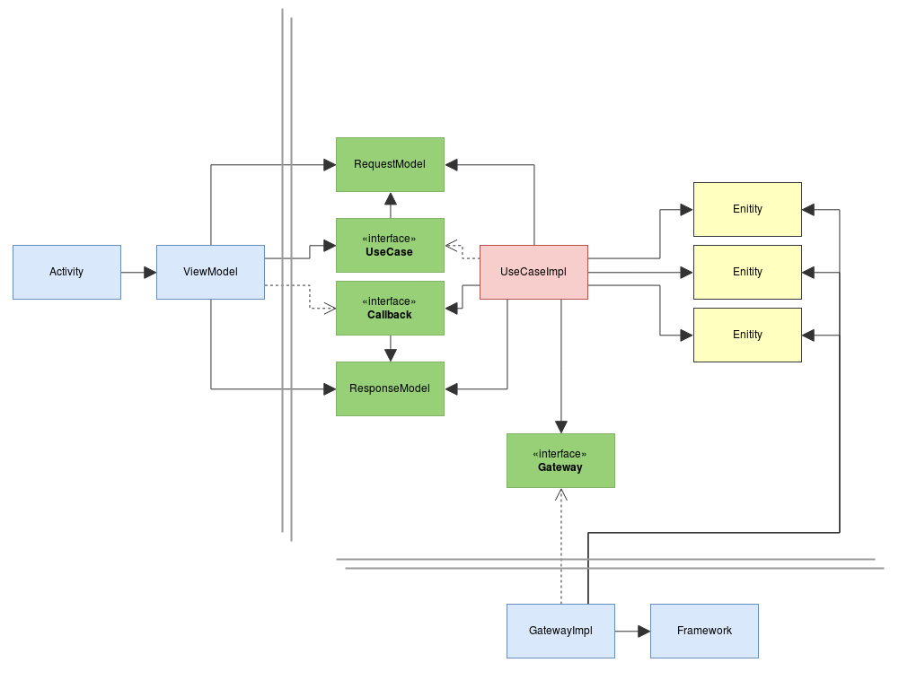

All App code is in
[app/src/main/java/mx/ucargo/android](app/src/main/java/mx/ucargo/android)
and is organized in a way when you read the directory list you get an app, data, entities, form,
gallery, providers and usecase. The idea is to know where the files are so, if you want to modify
the gallery everything should be in there

- [signin]: *TODO*

- [usecase]: Center of the
  business rules. All the rules of what the app can do are here. Are constructed in a way that can
  be reused across all features

- [entity]: Center of the
  application; here there are models that holds information of what the app does

- [data]: Data handling like
  downloading images and storing into a database

- [providers]: Provide
  information from app like version or from system like current time

- [app]: Android Application
  class and everything that is instantiated with an app scope and should be available from anywhere

This project is build using `Model-View-ViewModel` basically ViewModel substitutes Presenter in (MVP)
so the View (activities) only interact with UseCases using the ViewModel. The view is subscribed to
ViewModel changes and react to them. ViewModels should be ready to display, no complex
transformations or logic here (rather than view logic)

ViewModels are the bridge between Views and UseCases, they map request from the view into requests
to one or many UseCases.

UseCases are the business logic of the app, they abstract what the app does in terms of
`input -> UseCase -> output`. They request data to Gateways or from providers, manipulates them
according to a business rules.